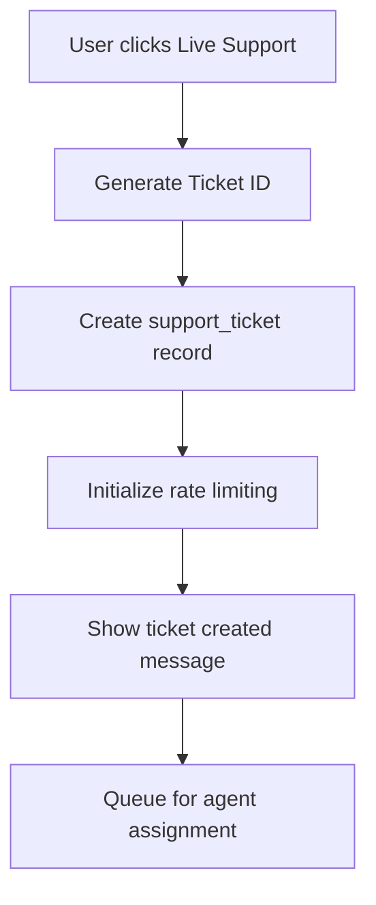
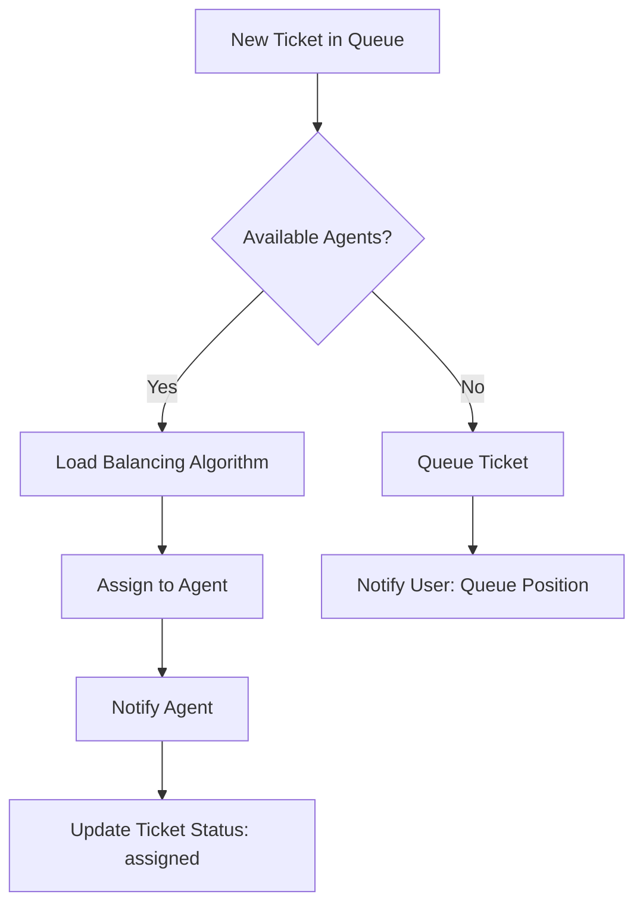
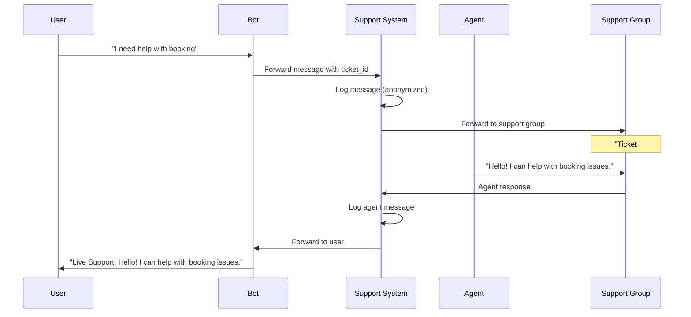

# Anonymous Live Chat Support System Architecture

## 🎯 System Overview

This document outlines the architecture for an anonymous live chat support system integrated into the existing appointment scheduler Telegram bot. The system provides secure, anonymous communication between users and support agents without exposing personal information.

## 🏗️ Core Architecture Principles

### Anonymity & Privacy
- **Zero-exposure design**: Support agents never see user personal information
- **Ticket-based routing**: All communication routed through unique ticket IDs
- **Secure forwarding**: Messages forwarded without revealing sender identity
- **Isolated contexts**: Support sessions completely isolated from appointment data

### Scalability & Performance  
- **Queue-based processing**: Handle high volumes with message queuing
- **Agent load balancing**: Distribute tickets across available agents
- **Rate limiting**: Prevent abuse while maintaining responsiveness
- **Persistent storage**: Maintain conversation history and state

## 📊 Database Schema Design

### Support Tables

```sql
-- Support tickets tracking table
CREATE TABLE support_tickets (
    id INT PRIMARY KEY AUTO_INCREMENT,
    ticket_id VARCHAR(32) UNIQUE NOT NULL,        -- SUPP-timestamp-random
    user_id INT NOT NULL,                         -- References users.id
    agent_id INT NULL,                            -- References users.id (support agents)
    status ENUM('open', 'assigned', 'closed', 'escalated') DEFAULT 'open',
    priority ENUM('low', 'medium', 'high', 'critical') DEFAULT 'medium',
    category VARCHAR(50) NULL,                    -- 'booking', 'technical', 'billing', etc.
    
    -- Metadata
    created_at TIMESTAMP DEFAULT CURRENT_TIMESTAMP,
    assigned_at TIMESTAMP NULL,
    closed_at TIMESTAMP NULL,
    last_message_at TIMESTAMP NULL,
    
    -- Configuration
    auto_close_at TIMESTAMP NULL,                 -- Auto-close inactive tickets
    escalation_level INT DEFAULT 0,               -- 0=L1, 1=L2, 2=L3 support
    
    INDEX idx_ticket_id (ticket_id),
    INDEX idx_user_status (user_id, status),
    INDEX idx_agent_status (agent_id, status),
    INDEX idx_status_priority (status, priority),
    FOREIGN KEY (user_id) REFERENCES users(id),
    FOREIGN KEY (agent_id) REFERENCES users(id)
);

-- Message history for support conversations
CREATE TABLE support_messages (
    id INT PRIMARY KEY AUTO_INCREMENT,
    ticket_id VARCHAR(32) NOT NULL,
    
    -- Message content
    message_text TEXT NOT NULL,
    message_type ENUM('user', 'agent', 'system') NOT NULL,
    telegram_message_id INT NULL,                 -- Original Telegram message ID
    
    -- Sender info (anonymized for agents)
    sender_id INT NOT NULL,                       -- User or agent ID
    sender_type ENUM('user', 'agent', 'system') NOT NULL,
    
    -- Metadata
    created_at TIMESTAMP DEFAULT CURRENT_TIMESTAMP,
    edited_at TIMESTAMP NULL,
    is_internal BOOLEAN DEFAULT FALSE,            -- Internal agent notes
    
    INDEX idx_ticket_time (ticket_id, created_at),
    INDEX idx_sender (sender_id, sender_type),
    FOREIGN KEY (ticket_id) REFERENCES support_tickets(ticket_id)
);

-- Agent assignments and load balancing
CREATE TABLE support_agent_assignments (
    id INT PRIMARY KEY AUTO_INCREMENT,
    agent_id INT NOT NULL,
    ticket_id VARCHAR(32) NOT NULL,
    
    -- Assignment details
    assigned_at TIMESTAMP DEFAULT CURRENT_TIMESTAMP,
    unassigned_at TIMESTAMP NULL,
    assignment_type ENUM('auto', 'manual', 'escalated') DEFAULT 'auto',
    
    -- Performance tracking
    first_response_time INT NULL,                 -- Seconds to first response
    avg_response_time DECIMAL(8,2) NULL,          -- Average response time
    satisfaction_rating INT NULL,                 -- 1-5 rating
    
    INDEX idx_agent_active (agent_id, unassigned_at),
    INDEX idx_ticket_assignment (ticket_id, assigned_at),
    FOREIGN KEY (agent_id) REFERENCES users(id),
    FOREIGN KEY (ticket_id) REFERENCES support_tickets(ticket_id)
);

-- Rate limiting and abuse prevention
CREATE TABLE support_rate_limits (
    id INT PRIMARY KEY AUTO_INCREMENT,
    user_id INT NOT NULL,
    
    -- Rate limiting windows
    daily_tickets INT DEFAULT 0,
    hourly_messages INT DEFAULT 0,
    
    -- Tracking
    last_ticket_at TIMESTAMP NULL,
    last_message_at TIMESTAMP NULL,
    reset_daily_at TIMESTAMP NOT NULL,
    reset_hourly_at TIMESTAMP NOT NULL,
    
    -- Flags
    is_blocked BOOLEAN DEFAULT FALSE,
    block_reason VARCHAR(255) NULL,
    blocked_until TIMESTAMP NULL,
    
    UNIQUE KEY unique_user (user_id),
    INDEX idx_reset_times (reset_daily_at, reset_hourly_at),
    FOREIGN KEY (user_id) REFERENCES users(id)
);

-- Support agent status and availability
CREATE TABLE support_agent_status (
    id INT PRIMARY KEY AUTO_INCREMENT,
    agent_id INT NOT NULL,
    
    -- Status
    status ENUM('available', 'busy', 'away', 'offline') DEFAULT 'offline',
    max_concurrent_tickets INT DEFAULT 5,
    current_ticket_count INT DEFAULT 0,
    
    -- Shift information
    shift_start TIME NULL,
    shift_end TIME NULL,
    timezone VARCHAR(50) DEFAULT 'UTC',
    
    -- Performance metrics
    avg_response_time DECIMAL(8,2) NULL,
    total_tickets_handled INT DEFAULT 0,
    satisfaction_score DECIMAL(3,2) NULL,
    
    updated_at TIMESTAMP DEFAULT CURRENT_TIMESTAMP ON UPDATE CURRENT_TIMESTAMP,
    
    UNIQUE KEY unique_agent (agent_id),
    INDEX idx_status_availability (status, current_ticket_count, max_concurrent_tickets),
    FOREIGN KEY (agent_id) REFERENCES users(id)
);
```

## 🔄 Anonymous Support Flow Design

### 1. Support Request Initiation



**Process Details:**
- **Ticket ID Generation**: `SUPP-${timestamp}-${randomString(6)}`
- **Initial Status**: `open` with `medium` priority
- **Rate Limit Check**: Verify user hasn't exceeded daily limits
- **User Notification**: "Support ticket #SUPP-xxx created. An agent will assist you shortly."

### 2. Agent Assignment & Routing



**Assignment Algorithm:**
```javascript
function assignAgent(ticket) {
    const availableAgents = getAvailableAgents();
    
    // Priority-based assignment
    if (ticket.priority === 'critical') {
        return availableAgents.find(agent => agent.level >= 2) || availableAgents[0];
    }
    
    // Load balancing: assign to agent with least active tickets
    return availableAgents.sort((a, b) => 
        a.current_ticket_count - b.current_ticket_count
    )[0];
}
```

### 3. Anonymous Message Flow



## 🔒 Security & Anonymity Mechanisms

### User Anonymization
```javascript
class AnonymizationService {
    static anonymizeForAgent(user, ticketId) {
        return {
            displayName: `User-${ticketId.slice(-6)}`,
            ticketId: ticketId,
            joinedDate: user.created_at.toDateString(),
            // No personal information exposed
        };
    }
    
    static formatAgentMessage(message, agentName) {
        return `Live Support: ${message}`;
    }
}
```

### Secure Message Forwarding
- **User → Agent**: Messages stripped of metadata, forwarded with ticket context
- **Agent → User**: Agent identity masked as "Live Support"
- **Internal Logging**: Full audit trail with anonymized external presentation

### Access Control
```sql
-- Agent permissions
UPDATE users SET role = 'support_agent' WHERE id IN (...);

-- Support group membership verification
CREATE TABLE support_group_members (
    user_id INT NOT NULL,
    telegram_chat_id BIGINT NOT NULL,
    added_at TIMESTAMP DEFAULT CURRENT_TIMESTAMP,
    is_active BOOLEAN DEFAULT TRUE,
    FOREIGN KEY (user_id) REFERENCES users(id)
);
```

## 🔧 Key System Components

### 1. Support Callback Handler
```javascript
class SupportCallbackHandler {
    async handleLiveSupportRequest(ctx) {
        // Rate limiting check
        if (!await this.checkRateLimit(ctx.from.id)) {
            return ctx.reply('You have reached the support request limit. Please try again later.');
        }
        
        // Generate ticket
        const ticketId = this.generateTicketId();
        
        // Create ticket record
        const ticket = await SupportTicket.create({
            ticket_id: ticketId,
            user_id: ctx.from.id,
            status: 'open'
        });
        
        // Initialize session
        ctx.session.supportTicketId = ticketId;
        ctx.session.state = 'support_chat';
        
        await ctx.reply(`✅ Support ticket ${ticketId} created. An agent will assist you shortly.`);
        
        // Queue for assignment
        await this.queueTicketForAssignment(ticket);
    }
}
```

### 2. Message Anonymizer
```javascript
class MessageAnonymizer {
    static async forwardToSupport(message, ticketId, userId) {
        const supportGroupId = process.env.SUPPORT_GROUP_CHAT_ID;
        
        // Create anonymized message
        const anonymizedMessage = `🎫 Ticket: ${ticketId}\n👤 User: Anonymous\n\n${message}`;
        
        // Forward using copyMessage for media support
        await bot.telegram.sendMessage(supportGroupId, anonymizedMessage, {
            reply_markup: {
                inline_keyboard: [[
                    { text: 'Reply', callback_data: `reply_${ticketId}` },
                    { text: 'Close', callback_data: `close_${ticketId}` },
                    { text: 'Escalate', callback_data: `escalate_${ticketId}` }
                ]]
            }
        });
        
        // Log message
        await SupportMessage.create({
            ticket_id: ticketId,
            message_text: message,
            sender_id: userId,
            sender_type: 'user'
        });
    }
}
```

### 3. Ticket Management System
```javascript
class TicketManager {
    async assignTicket(ticketId, agentId) {
        const ticket = await SupportTicket.findByTicketId(ticketId);
        
        await ticket.update({
            agent_id: agentId,
            status: 'assigned',
            assigned_at: new Date()
        });
        
        // Create assignment record
        await SupportAgentAssignment.create({
            agent_id: agentId,
            ticket_id: ticketId,
            assignment_type: 'auto'
        });
        
        // Update agent status
        await this.updateAgentTicketCount(agentId, 1);
    }
    
    async closeTicket(ticketId, closedBy) {
        const ticket = await SupportTicket.findByTicketId(ticketId);
        
        await ticket.update({
            status: 'closed',
            closed_at: new Date()
        });
        
        // Update agent availability
        if (ticket.agent_id) {
            await this.updateAgentTicketCount(ticket.agent_id, -1);
        }
        
        // Notify user
        await this.notifyTicketClosed(ticket.user_id, ticketId);
    }
}
```

### 4. Agent Routing System
```javascript
class AgentRoutingSystem {
    async getNextAvailableAgent(priority = 'medium') {
        const agents = await db('support_agent_status')
            .where('status', 'available')
            .where('current_ticket_count', '<', 'max_concurrent_tickets')
            .orderBy('current_ticket_count', 'asc')
            .orderBy('avg_response_time', 'asc');
            
        if (priority === 'critical') {
            // Prefer senior agents for critical issues
            const seniorAgents = agents.filter(a => a.satisfaction_score > 4.0);
            return seniorAgents[0] || agents[0];
        }
        
        return agents[0];
    }
    
    async balanceAgentLoad() {
        // Redistribute tickets if agents become unavailable
        const overloadedAgents = await this.getOverloadedAgents();
        
        for (const agent of overloadedAgents) {
            await this.redistributeTickets(agent.agent_id);
        }
    }
}
```

### 5. Rate Limiter with Queue
```javascript
class SupportRateLimiter {
    async checkAndUpdateLimits(userId) {
        const limits = await SupportRateLimit.findOrCreate(userId);
        const now = new Date();
        
        // Reset counters if windows expired
        if (now > limits.reset_hourly_at) {
            limits.hourly_messages = 0;
            limits.reset_hourly_at = new Date(now.getTime() + 60 * 60 * 1000);
        }
        
        if (now > limits.reset_daily_at) {
            limits.daily_tickets = 0;
            limits.reset_daily_at = new Date(now.getTime() + 24 * 60 * 60 * 1000);
        }
        
        // Check limits
        if (limits.daily_tickets >= 5 || limits.hourly_messages >= 50) {
            return { allowed: false, reason: 'rate_limit_exceeded' };
        }
        
        // Update counters
        limits.hourly_messages++;
        await limits.save();
        
        return { allowed: true };
    }
}
```

## 📱 API Design & Handler Interfaces

### Callback Handlers
```javascript
// Support button callback
bot.action('live_support', SupportCallbackHandler.handleLiveSupportRequest);

// Agent reply callback  
bot.action(/reply_(.+)/, AgentCallbackHandler.handleAgentReply);

// Close ticket callback
bot.action(/close_(.+)/, AgentCallbackHandler.handleCloseTicket);

// Escalate callback
bot.action(/escalate_(.+)/, AgentCallbackHandler.handleEscalateTicket);
```

### Message Handlers
```javascript
// Support chat message handler
bot.on('text', async (ctx) => {
    if (ctx.session?.state === 'support_chat') {
        await SupportMessageHandler.handleUserMessage(ctx);
    }
});

// Support group message handler (for agents)
bot.on('text', async (ctx) => {
    if (ctx.chat.id === process.env.SUPPORT_GROUP_CHAT_ID) {
        await SupportMessageHandler.handleAgentMessage(ctx);
    }
});
```

### REST API Endpoints
```javascript
// Support management API
app.get('/api/support/tickets', SupportController.getTickets);
app.get('/api/support/tickets/:ticketId', SupportController.getTicket);
app.put('/api/support/tickets/:ticketId/assign', SupportController.assignTicket);
app.put('/api/support/tickets/:ticketId/close', SupportController.closeTicket);
app.get('/api/support/agents/status', SupportController.getAgentStatus);
app.put('/api/support/agents/:agentId/status', SupportController.updateAgentStatus);
```

## ⚡ Performance Optimizations

### Caching Strategy
```javascript
// Redis cache for active tickets
const activeTicketsCache = new Map();

// Cache agent availability
const agentStatusCache = {
    ttl: 30000, // 30 seconds
    data: new Map()
};

// Message queue for high-volume processing
const messageQueue = new Queue('support-messages', {
    redis: { port: 6379, host: '127.0.0.1' }
});
```

### Database Optimization
- **Indexing**: Optimized indexes on frequently queried columns
- **Partitioning**: Archive old support messages to separate tables
- **Connection Pooling**: Efficient database connection management
- **Query Optimization**: Use prepared statements and query optimization

## 🛡️ Security Measures

### Input Validation
```javascript
const messageValidator = {
    maxLength: 2000,
    allowedTypes: ['text', 'photo', 'document'],
    sanitize: true,
    rateLimit: true
};
```

### Audit Logging
```javascript
class SupportAuditLogger {
    static async logAction(action, ticketId, userId, details) {
        await db('support_audit_log').insert({
            action,
            ticket_id: ticketId,
            user_id: userId,
            details: JSON.stringify(details),
            ip_address: ctx.request?.ip,
            user_agent: ctx.request?.headers['user-agent'],
            created_at: new Date()
        });
    }
}
```

### Data Protection
- **Encryption**: Sensitive data encrypted at rest
- **Access Control**: Role-based access to support functions
- **Data Retention**: Automatic cleanup of old support data
- **Privacy Compliance**: GDPR/CCPA compliant data handling

## 📈 Monitoring & Analytics

### Performance Metrics
```javascript
const supportMetrics = {
    // Response time tracking
    avgFirstResponseTime: '2.3 minutes',
    avgResolutionTime: '12.7 minutes',
    
    // Volume metrics
    dailyTicketVolume: 145,
    peakHourLoad: '2PM - 3PM',
    
    // Quality metrics
    customerSatisfaction: 4.2,
    ticketResolutionRate: 0.94,
    agentUtilization: 0.78
};
```

### Real-time Dashboard
- Active ticket count and status distribution
- Agent availability and workload
- Response time trends
- Customer satisfaction scores
- System health and error rates

## 🚀 Implementation Roadmap

### Phase 1: Core Infrastructure (Week 1-2)
- [ ] Database schema implementation
- [ ] Basic ticket creation and management
- [ ] Agent assignment system
- [ ] Message forwarding functionality

### Phase 2: Anonymous Communication (Week 3-4)
- [ ] Message anonymization service
- [ ] Secure forwarding between users and agents
- [ ] Support group integration
- [ ] Rate limiting implementation

### Phase 3: Advanced Features (Week 5-6)
- [ ] Agent performance tracking
- [ ] Ticket escalation system
- [ ] Auto-close inactive tickets
- [ ] Support analytics dashboard

### Phase 4: Optimization & Monitoring (Week 7-8)
- [ ] Performance optimization
- [ ] Comprehensive monitoring
- [ ] Security audit and hardening
- [ ] Load testing and scaling

## 🔧 Configuration & Deployment

### Environment Variables
```bash
# Support System Configuration
SUPPORT_GROUP_CHAT_ID=-1001234567890
MAX_DAILY_TICKETS_PER_USER=5
MAX_HOURLY_MESSAGES_PER_USER=50
TICKET_AUTO_CLOSE_HOURS=24
AGENT_MAX_CONCURRENT_TICKETS=5

# Performance Tuning
SUPPORT_MESSAGE_QUEUE_WORKERS=3
SUPPORT_CACHE_TTL=300
DATABASE_CONNECTION_POOL_SIZE=10
```

### Deployment Considerations
- **High Availability**: Deploy across multiple instances
- **Load Balancing**: Distribute load across bot instances  
- **Database Scaling**: Read replicas for analytics queries
- **Queue Management**: Redis cluster for message queuing
- **Monitoring**: Comprehensive logging and alerting

## 📋 Testing Strategy

### Unit Tests
- Ticket creation and management
- Message anonymization
- Rate limiting logic
- Agent assignment algorithms

### Integration Tests
- End-to-end support flow
- Telegram API integration
- Database operations
- Queue processing

### Load Testing
- High-volume ticket creation
- Concurrent agent assignments
- Message processing throughput
- Database performance under load

---

## 📝 Summary

This architecture provides a comprehensive, secure, and scalable anonymous live chat support system that integrates seamlessly with the existing appointment scheduler. The design ensures complete user anonymity while providing efficient support operations, robust error handling, and comprehensive monitoring capabilities.

The system is built with modern best practices including proper separation of concerns, comprehensive error handling, performance optimization, and security-first design principles.